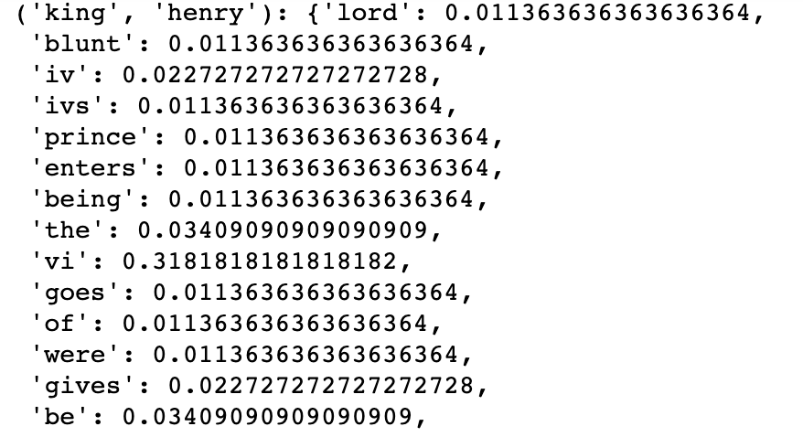
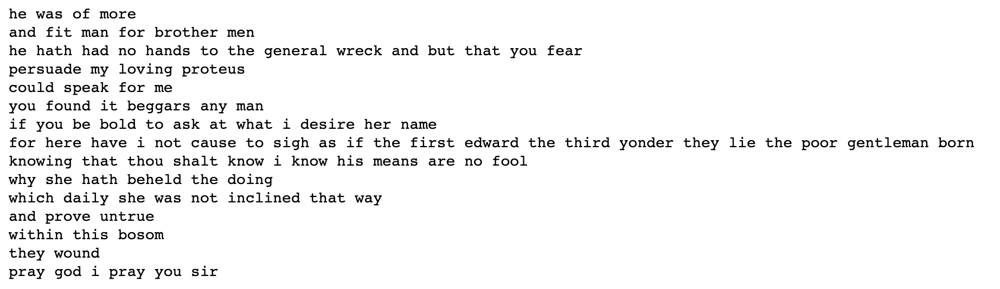

# Machine-Learning-Project-2
Text Corpus using Hidden Markov Model

# Authors
- Sandip Dey
- Shambo Ghosh

# Introduction
- It is a Jupyter Notebook for generation of new text from text corpus and perform text prediction given a set of words using Hidden Markov Model

# Dataset Used
- alllines.txt - https://www.kaggle.com/kingburrito666/shakespeare-plays

# How to run the program
Just run the Jupyter Notebook through Anaconda

# Process Explanation
For generation of text corpus, we will make use of a 2nd-order Markov model. 
- At first, we need to clean up the data and then train a Markov model on the cleaned up data.
- The training of the Markov model can be divided into the following stages -

1. Tokenisation
2. Building the state pairs
3. Determining the probability distribution

- Tokenisation is nothing but breaking down the sentence into words
- The second stage consists of forming the previous and current state pairs. Since we are building a 2nd-order Markov model, our previous state will consist of two words.
- Once we have formed the state pairs, in stage 3 all we need to do is perform simple counts and calculate the probability of the next states possible for a given current state as before.

Once we have completed the training, we will have the initial word distribution, second-word distribution and the state transition distributions. Next to generate a new text, all we need is to write a function to sample out from the above-created distributions.

# Project Structure
- Data : Datasets
- Notebook : textcorpus.ipynb
- Plots - Some example graphs

# References
https://medium.com/ymedialabs-innovation/next-word-prediction-using-markov-model-570fc0475f96
